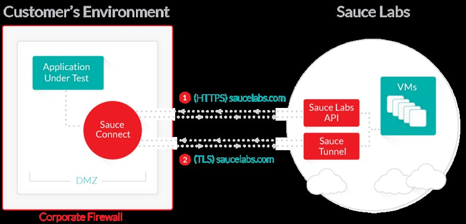

##Compozed Global Lunch and Learn
### CI/CD Acceptance Tests
---
### CI/DC
  * Continuous Integration and Continuous Delivery/Deployment are two agile practices that merges development with testing, allowing developers to build code collaboratively, submit it the master branch, and checked for issues. This allows developers to not only build their code, but also test their code in any environment type and as often as possible to catch bugs early in the applications development lifecycle.
+++
  * It provides an immediate feedback loop allowing developers to test and incorporate small changes one at a time as soon as the code it written for an individual feature, chore, bug fix or refactor.
---
### Continuous Integration
  * Code is integrated and tested many times a day, one set of changes at a time.  "The main aim of CI is to prevent integration problems, referred to as "integration hell" in early descriptions of XP." - Wikipedia
---
### Continuous Delivery
  * Continuous delivery (CD) is a software engineering approach in which teams produce software in short cycles, ensuring that the software can be reliably released at any time. It aims at building, testing, and releasing software faster and more frequently. The approach helps reduce the cost, time, and risk of delivering changes by allowing for more incremental updates to applications in production. A straightforward and repeatable deployment process is important for continuous delivery.
---
### Acceptance Tests
  * Part of the CI/CD pipeline process and the process of TDD (test driven development)
  * Automated tests ensuring the environment/application is successfully built to allow for manual User Acceptance testing.  The system always improves and never backslides.
  * Tests that all units, when used together, work as per the feature's specification in as close to an environment as possible to the production environment.
  * Along with unit tests, they ensure that new code and changes made by a pair works.
  * Running the full set of unit and integration tests before each integration of new code will show if any test fails, it is that pair’s code that is failing the system and should reduce if not eliminate broken code being pushed through the pipeline.
  * Front end: UI Tests
  * Back end: Smoke/End-to-End Tests
+++
  * CI Pipeline
    * Acceptance tests come before deploying to UAT/TEST environment
      * Assuming DEV --> UAT --> PRE-PROD environments
    * Acceptance tests can be run in DEV environment
    * Ensures environment/application is up and running for manual user acceptance testing to be performed
    * Automated tests that ensure newly deployed code works in environment

---
### Acceptance Tests and User Stories
  * Tightly coupled to a user story, acceptance tests must be one or more tests to verify that a story has been properly implemented.
  * One benefit of Agile story writing is that the story itself provides the text of the acceptance tests. This outline is in the form of acceptance criteria. Consider the following example of a story sourced from a fictional, crowdsourced weather application:
  * A user story card contains a short description of the behavior of the system from the point of view of the customer.
  Example -
  * As a guest user, I would like to post a weather observation, so that other people enquiring about the weather have accurate, real-time information.
+++
  * Acceptance Criteria:
    * Given that I am on the weather observation submission page, When I submit a weather observation using the form, Then I should be redirected to the weather observations index page and see the weather observation I posted.
    * The concept hiding in the acceptance criteria is Behavior Driven Development (BDD). This is an oversimplification, but BDD can be thought of as an evolution of TDD which focuses on using sentences to describe behaviors of the system and implementing tests to match the sentences. We will use BDD as part of our approach.
---
### Back End
  * Smoke Tests
    * Determine if the app will run.  Ignoring unit and acceptance tests, smoke tests are written to run the basic application with its dependencies and services (like databases) to see if the application will deploy or catch on fire (hence the smoke).
    * Run after deploying new apps/infrastructure

---
### Back End
  * End-to-End Tests
    * Ensures data flows with the right values from beginning to end.
    * Just my thoughts - Is there a difference between acceptance tests and integration? If the back end is collecting, modifying and serving data, then unit tests and integration tests will cover the scenario.

---
### Back End
  * Health Check Endpoint Tests
    * Works well on web applications
      * Create a health route which calls each service and posts the status codes to the route.
      * Goes beyond acceptance test functionality and lends itself well to application support
    * Trigger: Deployed application
    * Test: Call the Endpoint and check the response is a 200
    * Results:
      * Success: All service calls return 200 - Results in App is HEALTHY!
      * Failure: If one service returns a 500 - App is SICK!

---
### Front End

    *Should aim to:*

    * Execute the intended functionality of the application using the GUI
      * Screen Navigation
      * Field Validation
      * Screen to screen workflow
      * Check Error Messages are displayed correctly
      * Check
---

  *Should not aim to:*

  * Check font sizes, colors, alignment, positioning ....

    These latter aims should be reserved for manual testing. Focusing on the above can lead to brittle tests subject to minor changes in screen design.

    Automated tests are code and should be subject to refactoring as a consequence.

---
### Acceptance Criteria
  * Every acceptance criteria statement noted in a user story should be covered in an acceptance test. They can also be used for test descriptions.
  * Adding a map between user story ID and acceptance test cases can offer a traceability matrix
  * Should be validated on as close to a production environment as practical
---
### Connecting external services vs not in testing
  * Some think you should not mocks/stubs the apps dependencies and services.
  * In our app, we make many get/post/update calls to service now.  They have a few test apis that are cloned from their real one. This allows our tests to mimic almost exactly what’s happening in our testing suite but the feedback loop is slow.
  * Unit tests can be written to test your code independently of external services which verify that the functions you have written behave as expected with out the bulk and lag time of connecting them to other external apis.

---
### Headless vs Std. Browser Tests
##### Std Browser
  * Closer to real life use of the application
  * Chrome & Firefox available
  * Can be tested in the pipeline
  * Can view success & failures as they happen
  * _Slower_
  * _Varying/Maintaining Browser Types & Versions_
  * _IE not available on our platforms_

---
### Headless vs Std Browser Tests
##### Headless Browser
  * Faster
  * _Further from real life use of the application_
  * _Will not highlight browser differences_

  _Despite the obvious cons, headless currently more widely used because:_
  * Performance
  * Testing focused on the 'intended functionality of the application'

---
### Tools
Tool | Description
------------ | -------------
**Selenium Webdriver** | Accepts commands via a Client API and sends them to a browser. Listens on port 4444
**PhantomJS** | An alternative to the above, not as widely used. Also provides a headless browser which can be used independently
---
Tool | Description
------------ | -------------
**Protractor** | An end-to-end testing framework, support for Angular
**CodeceptJS** | A promise based UI testing framework providing easy to read testing code. Also has support for Angular
---
Tool | Description
------------ | -------------
**chai** | Supporting component providing '_expect_' assertion code
**PhantomJS** | A headless browser providing screen capture capability
---
Tool | Description
------------ | -------------
**Nightmare** | An alternative to PhantomJS
---
### UI Testing Architecture

---
### Possible Future UI Testing Architecture

---
### Sample Process fro Writing Acceptance Tests
  * Read the acceptance criteria for a story
  * Write your test name to match that as best as possible
  * Write expectations to assert the completion of said criteria
  * Access elements on page to click, type into, submit, etc to mimic the user experience leading up to the expected result.
  * Write code and unit test new functions until acceptance test passes spiking where needed.
  * Look for sad paths and write another test to cover it.
  * Refactor tests and code where needed.
---
### Live Example Using CodeceptJS

_Copy link address below, download file and play_

[Coding Demo](file://172.30.23.255/users/localadmin/Public/Acceptance-testing.mov)

---
### CI/CD Acceptance Tests
  * Questions?

  Sources:
   - https://www.tutorialspoint.com/extreme_programming/extreme_programming_quick_guide.htm
  - Galvanize curriculum for Charlotte Accelerator
